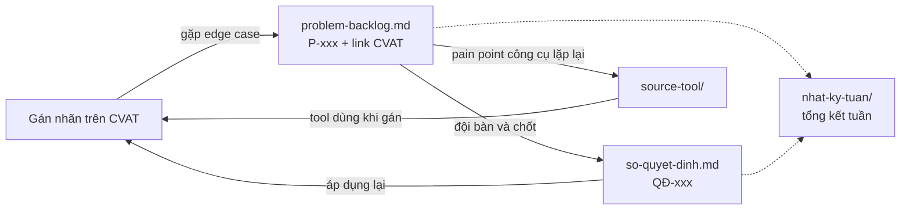

# Repo đội — Cohort 4A

Repo làm việc của một đội gán nhãn. Mỗi đội nhận một bản sao của template này.

> Tên người, handle GitHub, số liệu và link CVAT trong các file mẫu đều là **giả**,
> chỉ để minh hoạ cách ghi. Thay bằng dữ liệu của đội khi bắt đầu.

## Có gì trong repo

| Đường dẫn | Dùng để | Cập nhật khi nào |
|---|---|---|
| [`nhat-ky-tuan/`](nhat-ky-tuan/) | Ai giữ vị trí nào, được phân công gì, xong tới đâu | Đầu tuần phân công, cuối tuần chốt |
| [`problem-backlog.md`](problem-backlog.md) | Edge case gặp khi gán nhãn mà guideline chưa trả lời được, kèm link CVAT | **Ngay khi gặp** |
| [`so-quyet-dinh.md`](so-quyet-dinh.md) | Những gì đội đã chốt, và vì sao | Mỗi lần chốt một vấn đề |
| [`source-tool/`](source-tool/) | Source code công cụ đội tự viết để gỡ pain point khi gán nhãn | Khi đã xác định được pain point đáng làm tool |

## Các file nối với nhau thế nào

## Vị trí trong đội

| Vị trí | Việc chính |
|---|---|
| **Lead** | Chia job, điều phối, đưa edge case ra bàn và chốt, giữ sổ quyết định |
| **Annotator** | Gán nhãn theo guideline; gặp chỗ guideline không trả lời được thì ghi vào backlog thay vì tự đoán |
| **Reviewer** | Kiểm job đã gán, trả lại chỗ sai kèm lý do |

Một người có thể giữ nhiều vị trí, nhưng **không review job do chính mình gán**.

## Quy ước

- **Mã**: `P-001`, `QĐ-001`, đánh số tăng dần. Không dùng lại số của mục đã bỏ.
- **Nhắc người**: bằng handle GitHub, ví dụ `@thanh-vien-a`.
- **Link CVAT**: trỏ tới đúng job và frame (`.../jobs/<id>?frame=<n>`), không trỏ tới cả task —
  người đọc phải mở ra là thấy ngay chỗ có vấn đề.
- **Mục guideline**: ghi số mục (`§3.2`) để ai cũng tra lại được.
